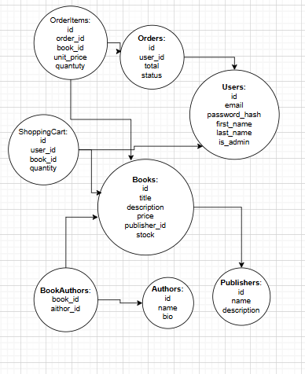

# Bookstore API

## Description 
The application allows users to browse books, authors and publishers, search and filter books, register and log in, manage their profile, use a shopping cart, and create orders.  
Administrators can manage books, authors and publishers.

---

## API Endpoints

### Books
- **GET /api/v1/books** — list all books. Supports search (`q`), filters (`author_id`, `publisher_id`, `genre`), sorting (`price_asc`, `price_desc`), and pagination (`page`, `page_size`).  
- **GET /api/v1/books/{id}** — get details of a specific book.  
- **POST /api/v1/books** (admin) — create a new book.  
- **PATCH /api/v1/books/{id}** (admin) — update book information.  
- **DELETE /api/v1/books/{id}** (admin) — remove a book.  

### Authors
- **GET /api/v1/authors** — list authors.  
- **GET /api/v1/authors/{id}** — author info and their books.  
- **POST /api/v1/authors** (admin) — add a new author.  
- **PATCH /api/v1/authors/{id}** (admin) — edit author.  
- **DELETE /api/v1/authors/{id}** (admin) — delete author.  

### Publishers
- **GET /api/v1/publishers** — list publishers.  
- **GET /api/v1/publishers/{id}** — publisher info and their books.  
- **POST /api/v1/publishers** (admin) — add a new publisher.  
- **PATCH /api/v1/publishers/{id}** (admin) — edit publisher.  
- **DELETE /api/v1/publishers/{id}** (admin) — delete publisher.  

### Auth / Users
- **POST /api/v1/auth/register** — user registration.  
- **POST /api/v1/auth/login** — log in and get access token.  
- **GET /api/v1/users/me** — view profile (requires authentication).  
- **PATCH /api/v1/users/me** — edit profile (requires authentication).  

### Shopping Cart
- **GET /api/v1/cart** — view items in the shopping cart (requires authentication).  
- **POST /api/v1/cart/items** — add or update an item in the shopping cart.  
- **DELETE /api/v1/cart/items/{book_id}** — remove item from the shopping cart.  

### Orders
- **POST /api/v1/orders** — create an order from the current shopping cart (requires authentication).  
- **GET /api/v1/orders** — list all orders of the authenticated user.  
- **GET /api/v1/orders/{id}** — get details of a specific order.  

---

## Database
The database contains the following entities:  

- **Users** — store user accounts.  
- **Books** — information about books.  
- **Authors** — authors of books.  
- **BookAuthors** — join table for many-to-many relation between books and authors.  
- **Publishers** — information about publishers.  
- **ShoppingCart** — items that users add before creating an order.  
- **Orders** — orders created by users.  
- **OrderItems** — books included in each order.  

---

## ER Diagram

